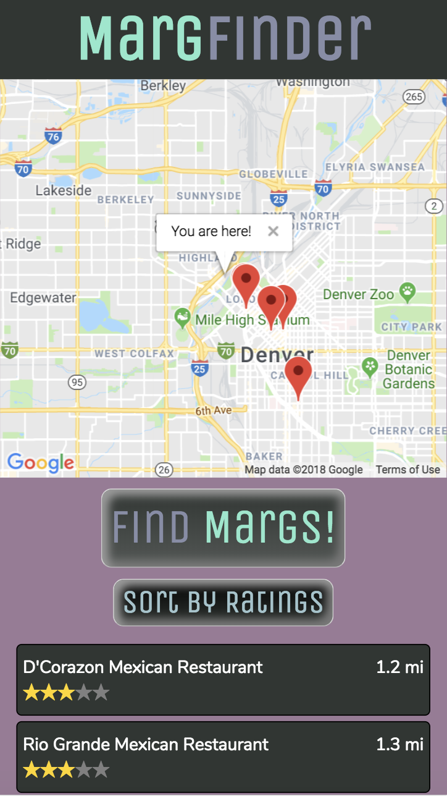

# Marg Finder

## View Live
https://marg-finder.firebaseapp.com/

## What It Is
Marg Finder is an app that suggests five establishments that serve margaritas. I collaborated with other developers to create an API that serves a sample Denver restaurant/bar data set to a React UI.

## Mobile View

## Local Installation
Fork and clone this repository. At the root of the repository, run `cd client && npm i && npm start` and in a new terminal window navigate back to the root of the repository and run `cd server && npm i && createdb drinks && knex migrate:latest && knex seed:run && node index.js`. Note that you will need Node.js, Postgres, and psql installed for these to run locally.

## License
MIT

## Contact
mjschreier1@gmail.com